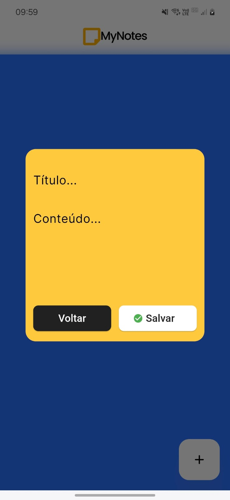
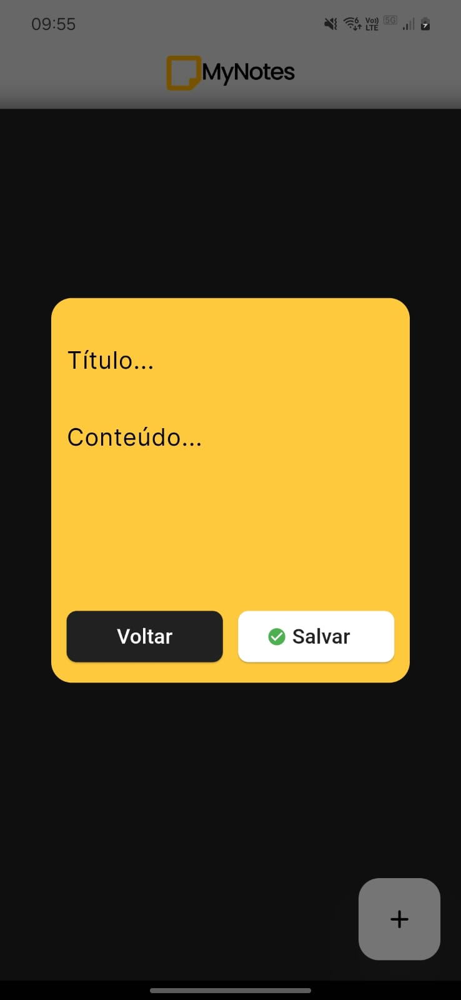
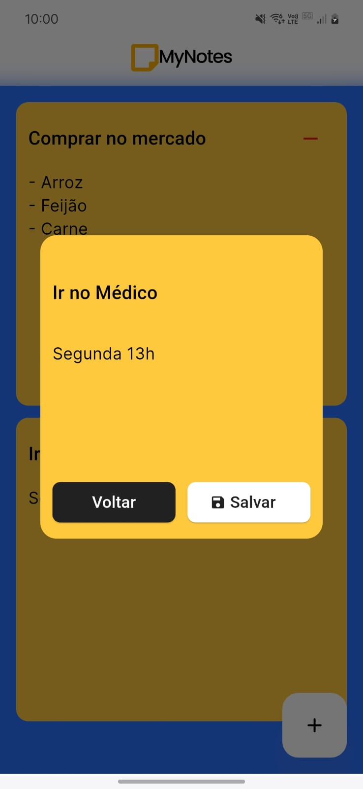
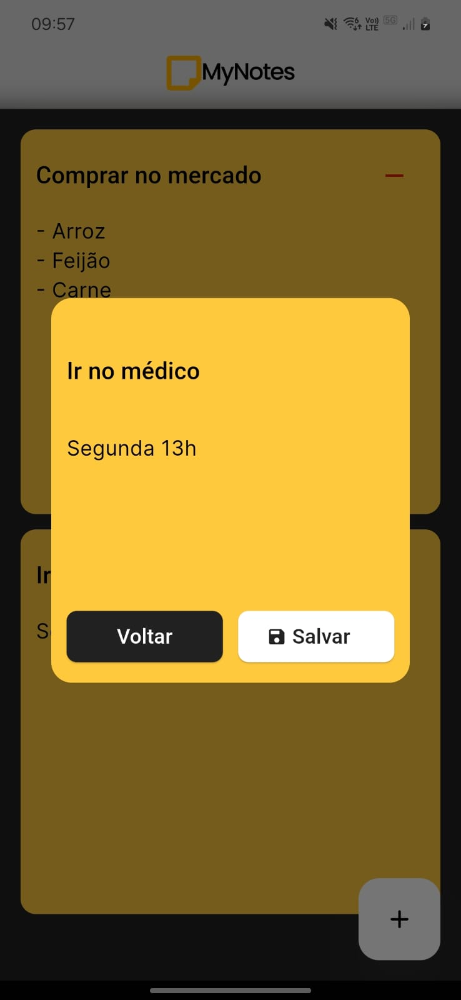
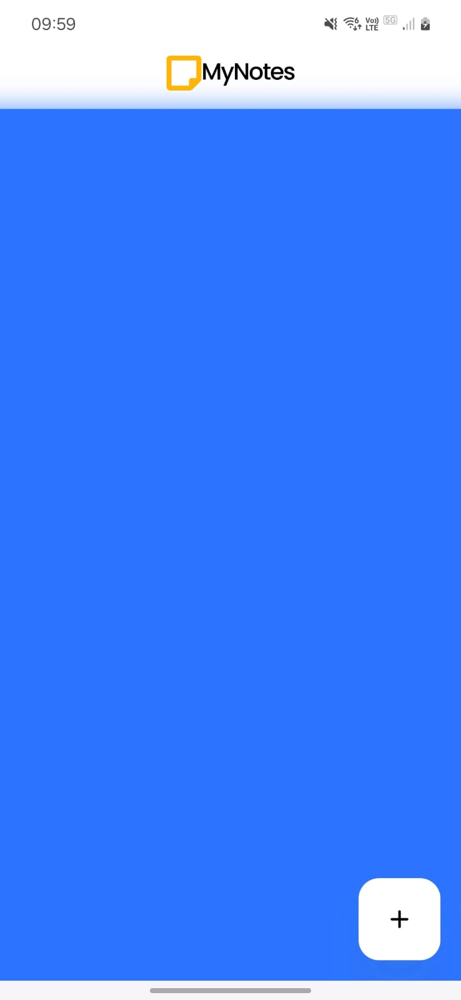
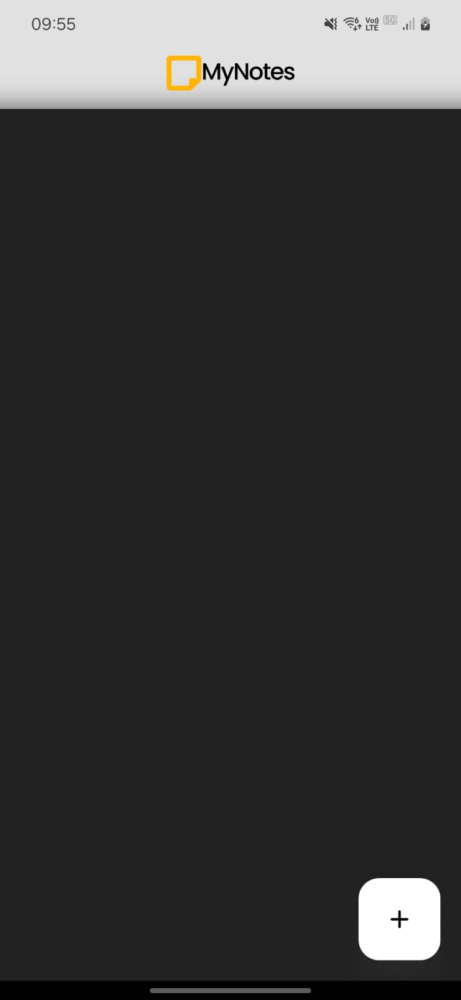

# MyNotes Mobile

The mobile app to simulate post-it notes.

## Table of contents

- [Screenshots](#screenshot)
- [Links](#links)
- [Build with](#build-with)
- [Challenges](#challenges)

## Screenshots

| Feature      | Light Mode                                    | DarkMode
:-------------:|:---------------------------------------------:|:---------------------------------------------:
Create         |    | 
Edit           |      | 
Your Notes     |     | 

## Links

- Mobile Repository: [GitHub](https://github.com/thiagofons/mynotes-modile)
- Back-End Repository: [GitHub](https://github.com/thiagofons/mynotes-back)

## Build with

- Flutter

## Challenges

1. Adapting my knowledge of mobile development from React Native to Flutter
2. Integrating the app with the back-end
